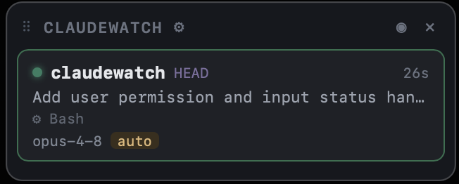
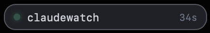
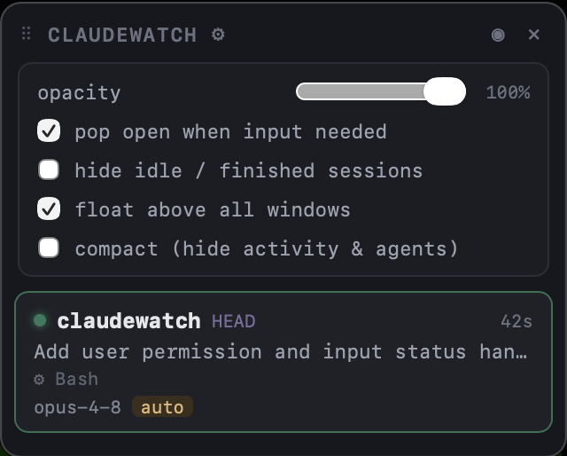

# claudewatch

> An always-on-top HUD for your live [Claude Code](https://claude.com/claude-code) sessions.

[](https://github.com/renereose/claudewatch/actions/workflows/ci.yml)
[](https://github.com/renereose/claudewatch/releases/latest)
[](LICENSE)


Run several Claude Code sessions at once and lose track of which one needs you?
**claudewatch** is a tiny floating widget that watches every live session and shows,
at a glance, which are working, which finished, and — most importantly — which are
**waiting for your input or permission**.

No server, no dependencies, no telemetry. It reads Claude Code's own local session
logs (`~/.claude/**`) directly and links only against system frameworks.

<p align="center">
  
</p>

<table align="center">
<tr>
  <td align="center" width="50%">
    <br>
    <sub><b>Bubble mode</b> — tuck it in a corner; glows amber when a session needs input.</sub>
  </td>
  <td align="center" width="50%">
    <br>
    <sub><b>Settings</b> — opacity, pop-open-on-input, hide idle, float-above-all, compact.</sub>
  </td>
</tr>
</table>

## Features

- **Live status per session** — working · waiting-for-input · done · interrupted, updated every 2s.
- **"Needs you" alerts** — surfaces the exact wait reason (`input needed`, `dialog open`,
  permission prompts, plan review, open questions, …) straight from Claude Code's session state,
  plus how long it's been waiting, and floats those sessions to the top.
- **Global hotkey** — <kbd>⌃⌥⌘J</kbd> from any app jumps straight to the next session that needs
  you; press again to cycle through the rest. With nothing waiting it surfaces the HUD. No
  Accessibility permission needed. Switch off in Settings.
- **Your last prompt** — each card shows the prompt that session is working on, so two sessions in
  the same repo are told apart at a glance (they also carry Claude Code's own session names).
- **Model & permission mode** — see which model each session runs and whether it's in
  `default`, `plan`, `auto-accept`, or `bypass` mode (color-coded).
- **Sub-agent tracking** — running vs. finished agents, including background agents.
- **Menu-bar widget** — a live session count with a state glyph mirroring the cards
  (`●` working · `▸` input needed · `✓` all done · `⊘` interrupted). Its dropdown lists every
  session (click to focus), plus optional summed CPU / RAM. Fully optional and customizable —
  set your own label template (`{n} worker{s}`).
- **Resource usage** — optional CPU %, memory, and context-token size (`117K`) per session.
- **Notifications** — optional ping when a session finishes or needs input (sound optional),
  or your own audio file played whenever a session needs you. Optionally re-notifies every 5
  minutes while a session is still waiting, so a missed banner doesn't cost you an hour.
- **Read it from anywhere** — `claudewatch --serve 8787` exposes the same JSON over HTTP for a
  desk display, a phone, or a Stream Deck. See [Serving the state](#serving-the-state).
- **Self-updating** — checks GitHub for a newer release, shows a notice, and (after asking)
  downloads it, replaces itself and restarts. Switch off in Settings.
- **Two modes** — a full **list** or a compact **bubble** you can tuck into a corner.
  The bubble glows amber the moment a session needs input; its rows click through to focus a
  session, and its header (`⠿` drag · `▤` expand) is what switches back to the list.
- **Works with the IDE plugin** — sessions run from the **Cursor** / **VS Code** Claude Code
  extension are tracked alongside terminal sessions, with the same status, model, mode, and
  "needs you" alerts. A small **host badge** on each card names where a session runs
  (`terminal` / `iterm` / `warp` / `cursor` / `code` / …).
- **Click to focus** — click a session to jump to where it lives. Terminal tabs are selected
  exactly; IDE sessions raise the editor window on that workspace:

  | Host | Focus |
  |------|-------|
  | Terminal.app | Exact tab (by tty) |
  | iTerm2 | Exact tab (by tty) |
  | Warp | App brought to front¹ |
  | Cursor / VS Code | Editor window for the session's folder² |

  ¹ Warp exposes no tab-scripting API (no AppleScript dictionary, URL scheme only creates tabs),
  so per-tab focus isn't possible. Anything else falls back to Terminal.app.
  ² IDE plugin sessions have no tty; clicking re-opens the workspace folder, which raises the
  window already on it (or opens one if the folder was closed).
- **Multi-config aware** — automatically picks up every `~/.claude*` config dir
  (e.g. `CLAUDE_CONFIG_DIR` aliases).
- **Settings** — opacity, "pop open when input needed", hide idle sessions, float-above-all,
  compact view, CPU/RAM · context · last-prompt toggles, menu-bar widget + label, the jump
  hotkey, notifications and re-notify, custom "needs you" sound.
  Remembers its position and preferences.

## Install

### Download (recommended)

1. Grab `Claudewatch.zip` from the [latest release](https://github.com/renereose/claudewatch/releases/latest).
2. Unzip and drag **Claudewatch.app** to `/Applications`.
3. **First launch — clear Gatekeeper.** The app is ad-hoc signed, not notarized by Apple,
   so macOS blocks it on first open ("Apple could not verify…"). Allow it once, either way:

   **Terminal:**
   ```sh
   xattr -dr com.apple.quarantine /Applications/Claudewatch.app
   open /Applications/Claudewatch.app
   ```

   **or GUI:** try to open it, then go to System Settings → **Privacy & Security** →
   scroll down → **Open Anyway**.

The app needs no runtime — the binary links only macOS system frameworks. It contains no
telemetry and reads only your local `~/.claude` logs; the Gatekeeper prompt is purely because
the project isn't paying for Apple notarization.

Its one network call is the update check: an unauthenticated `GET` to the GitHub releases API at
launch and every hour, sending nothing but the request. A newer tag lights up a notice in the HUD
and the menu; clicking it asks before downloading `Claudewatch.zip`, replacing the app in place,
and restarting it. Turn the whole thing off with Settings → **check github for updates**.

> On first click-to-focus, macOS will also ask for **Automation** permission (to raise the terminal tab).

### Claude Code plugin (optional)

Install the app first, then:

```sh
/plugin marketplace add renereose/claudewatch
/plugin install claudewatch@claudewatch
/reload-plugins
/claudewatch:approve      # once: clears Gatekeeper quarantine and launches the app
```

From then on a `SessionStart` hook opens the HUD whenever a Claude Code session starts, and
quietly does nothing if it's already running or the app isn't installed (e.g. you only run it
with `swift run`). The hook never touches Gatekeeper — `/claudewatch:approve` runs the
`xattr -dr com.apple.quarantine` line from step 3 above, only on Claudewatch.app, and only when
you ask for it. No MCP servers, no agents, no per-turn context cost.

To have the plugin update itself, run `/plugin`, go to **Marketplaces**, select **claudewatch**
and choose **Enable auto-update** — third-party marketplaces have it off by default. Each release
bumps the version in `.claude-plugin/marketplace.json` (via `scripts/set-version.sh`), which is
what tells Claude Code an update exists. Otherwise refresh by hand with
`/plugin marketplace update claudewatch`.

### Build it yourself

Don't want to trust a prebuilt binary? Build from source in one command — see [Build](#build) below.
A locally built app isn't quarantined, so it opens without the Gatekeeper prompt.

### Run from source

```sh
swift run claudewatch              # GUI, floating window
swift run claudewatch --dump       # print scanned sessions as JSON and exit
swift run claudewatch --serve 8787 # same JSON over HTTP (loopback)
swift run claudewatch --selftest   # run the assertions
```

## Build

```sh
./build.sh
```

Produces `Claudewatch.app` and a shareable `Claudewatch.zip`. Requires the Xcode
Command Line Tools (`xcode-select --install`).

### Project layout

```
Sources/claudewatch/
  Transcript.swift    # parse one session's .jsonl into a row
  Scanner.swift       # discover live sessions + assemble rows (scan)
  WebUI.swift         # the embedded HTML/CSS/JS UI
  DragView.swift      # native drag handle for the borderless panel
  Hotkey.swift        # global ⌃⌥⌘J jump-to-next-waiting chord
  Serve.swift         # --serve: the scan as a read-only HTTP endpoint
  AppDelegate.swift   # window, JS bridge, refresh loop
  main.swift          # entry point (--dump / --serve / --selftest + bootstrap)
Package.swift         # Swift package manifest
build.sh              # packages the .app bundle + zip
```

## Serving the state

`--serve` prints the same payload as `--dump`, over HTTP, scanned fresh per request — enough for
an ESP32 desk display, a phone on the couch, or a Stream Deck to show what needs you.

```sh
claudewatch --serve 8787            # http://127.0.0.1:8787 — this Mac only
claudewatch --serve 0.0.0.0:8787    # reachable from your LAN
curl -s localhost:8787 | jq .
```

**A bare port binds loopback only, on purpose.** The payload carries your working directory paths,
git branches and your last prompt — reaching it from the network is something you have to spell
out. Don't do it on a network you don't trust; there's no authentication.

It runs headless and independently of the HUD, so it fits a LaunchAgent. There is no setting for
it — the HUD itself never listens on a port.

## How it works

Claude Code records each session under `~/.claude/projects/**/*.jsonl` and tracks live
process status in `~/.claude/sessions/<pid>.json`. claudewatch:

1. Finds live sessions by verifying the recorded PID is still running.
2. Reads the authoritative `status` / `waitingFor` fields for each one (busy · shell · idle · waiting).
3. Parses the transcript for the title, current activity, model, permission mode, and sub-agents.
4. Renders it all in a borderless floating panel and refreshes every 2 seconds.

Everything is local. Nothing leaves your machine.

## Requirements

- macOS 12 (Monterey) or later
- [Claude Code](https://claude.com/claude-code) installed and used on the same machine

## Contributing

PRs welcome! See [CONTRIBUTING.md](CONTRIBUTING.md) and the
[Code of Conduct](CODE_OF_CONDUCT.md). Good first issues are labeled
[`good first issue`](https://github.com/renereose/claudewatch/labels/good%20first%20issue).

## License

[MIT](LICENSE) — do what you like, no warranty.
